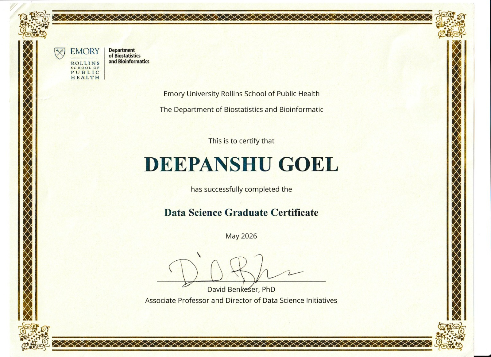

::: columns
::: {.column width="50%" style="text-align: center;"}

```{r, echo=FALSE, fig.align="center", out.width="80%"}

``` 

### Data Science Graduate Certificate – Emory University Rollins School of Public Health

Completed a graduate-level certificate in Data Science through the Department of Biostatistics and Bioinformatics at Emory University. Developed advanced skills in statistical programming, machine learning, data visualization, GIS, and data analytics using R and Python. Applied data science methods to public health and epidemiological research, strengthening expertise in managing, analyzing, and interpreting complex health data sets to support evidence-based decision-making.

:::

::: {.column width="50%" style="text-align: center;"}

```{r, echo=FALSE, fig.align="center", out.width="80%"}
knitr::include_url("files/Degree_Certificate_MBBS.pdf")
``` 

### MBBS (Bachelor of Medicine, Bachelor of Surgery) Degree

Earned an MBBS degree, providing comprehensive training in clinical medicine, patient care, disease diagnosis, treatment planning, and healthcare delivery. Developed a strong foundation in medical sciences, clinical research, evidence-based practice, and interdisciplinary healthcare, with extensive experience in patient assessment, clinical decision-making, and public health principles.

:::

::: columns
::: {.column width="50%" style="text-align: center;"}

```{r, echo=FALSE, fig.align="center", out.width="80%"}
knitr::include_url("files/CITI_Human_Subject_research_track_certificate.pdf")
``` 

### CITI Responsible Conduct of Research (RCR) – Human Subject Research Track

Completed comprehensive training in the ethical conduct of human subjects research, including research integrity, participant protection, informed consent, regulatory compliance, and responsible research practices. Demonstrated commitment to ethical standards and regulatory requirements in clinical and public health research.

:::

::: columns
::: {.column width="50%" style="text-align: center;"}

```{r, echo=FALSE, fig.align="center", out.width="80%"}
knitr::include_url("files/CITI_social_behavioral_certificate.pdf")
``` 

### Social Behavior Certificate (CITI)

:::

::: columns
::: {.column width="50%" style="text-align: center;"}

```{r, echo=FALSE, fig.align="center", out.width="80%"}
knitr::include_url("files/Coursera_data_visualization_certificate.pdf")
``` 

### Data Visualization using Python Certificate – University of Michigan (Coursera)

Completed a comprehensive training program in data visualization using Python, focusing on creating effective visual representations of complex datasets, exploratory data analysis, and communicating insights through charts, graphs, and statistical visualizations. Developed skills in Python-based data analysis and visualization techniques to support evidence-based decision-making and public health research

:::

::: columns
::: {.column width="50%" style="text-align: center;"}

```{r, echo=FALSE, fig.align="center", out.width="80%"}
knitr::include_url("files/Coursera_maths_certificate.pdf")
``` 

### Data Science Math Skills Certificate – Duke University (Coursera)

Completed coursework in foundational mathematical concepts for data science, including algebra, functions, logarithms, probability, statistics, and quantitative reasoning. Strengthened analytical and problem-solving skills essential for data analysis, statistical modeling, and evidence-based decision-making.

:::